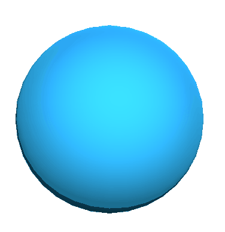

# Dissolve Shader
A simple, noise-based dissolve shader. 

Edges that are very close to being dissolved are colored with an edge color.

# Requires

	- Noise Texture

It takes a noise texture and a float between 0-1 (set in script using a sine wave) for the current level of deformation.

# Example

